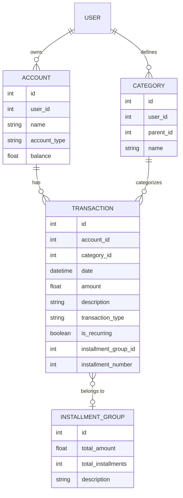

# SPEC - Financial Management Module (FinanceCore)

## 1. Visão Geral
O módulo **FinanceCore** transforma o Personal Agent em um centro de comando financeiro inteligente. Ele permite a gestão de finanças pessoais, familiares e profissionais (IT Consultancy), com foco em automação via extração de dados de documentos e visualização em dashboards.

## 2. Objetivos
- Centralizar transações financeiras (receitas e despesas), incluindo suporte a **transações recorrentes** e **compras parceladas**.
- Suportar múltiplas categorias (salários, serviços extras, lazer, contas fixas).
- **Gestão de Estrutura**: Painel para gerenciar contas bancárias, cartões de crédito, categorias e subcategorias.
- **Vínculo Obrigatório**: Toda transação deve estar obrigatoriamente atrelada a uma conta ou cartão.
- **Extração Inteligente**: Processar PDFs (boletos/extratos), CSV/XLSX e Imagens (vouchers/notas fiscais) usando IA Multimodal (Gemini 2.5 Pro).
- Dashboards financeiros em tempo real no dashboard React.

## 3. Arquitetura do Agente
O Supervisor do Personal Agent será expandido para incluir um `FinancialAgent` especializado ou um conjunto de ferramentas robustas:

### Fluxo no LangGraph:
1. **User Prompt**: "Adicione essa nota fiscal que acabei de subir".
2. **Perception**: O agente identifica o anexo/arquivo.
3. **Tool Call (`extract_financial_data`)**: Processa o arquivo e extrai {data, valor, descrição, categoria}.
4. **Validation (HITL)**: O agente mostra os dados extraídos e pede confirmação: "Extraí R$ 150,00 de 'Restaurante'. Confirma?".
5. **Persistence**: Salva no PostgreSQL após aprovação.

## 4. Especificação Técnica

### Modelagem de Dados (ER Diagram)

### Endpoints FastAPI:
- `GET /api/finance/accounts`: Listar contas e saldos.
- `POST /api/finance/accounts`: Criar nova conta/cartão.
- `GET /api/finance/categories`: Árvore de categorias.
- `POST /api/finance/transactions`: Criar transação manual.
- `POST /api/finance/upload`: Upload de arquivos para extração.
- `GET /api/finance/dashboard`: Dados agregados para gráficos.
- `GET /api/finance/reports`: Relatórios formatados (PDF/CSV).

### Esquema de Banco de Dados (PostgreSQL):
- Tabela `finance_accounts`: `id`, `user_id`, `name`, `type`, `balance`.
- Tabela `finance_categories`: `id`, `user_id`, `name`, `parent_id`.
- Tabela `finance_installment_groups`: `id`, `total_amount`, `total_installments`, `description`.
- Tabela `finance_transactions`: `id`, `account_id`, `category_id`, `date`, `amount`, `description`, `type`, `is_recurring`, `installment_group_id`, `installment_number`, `source_metadata`.

## 5. Design de Tooling
- `extract_financial_data(file_path: str)`: Usa Gemini Vision para imagens/PDFs e Pandas para planilhas.
- `generate_financial_summary(period: str)`: Calcula saldos e totais por categoria.
- `query_finance_db(query: str)`: Permite buscas complexas em transações.

## 6. Roadmap de Execução (Sprints)

### Sprint 1: Fundação e Persistência
- Modelagem de dados e migrações.
- Crud básico de transações via API.
- Testes de persistência.

### Sprint 2: Extração Inteligente
- Integração com Gemini Vision para OCR de notas fiscais.
- Parser de CSV/XLSX.
- Fluxo de confirmação (Human-in-the-Loop).

### Sprint 3: UI e Dashboards
- Componentes React dinâmicos para tabelas e gráficos.
- Integração de upload no frontend.
- Relatórios exportáveis.
