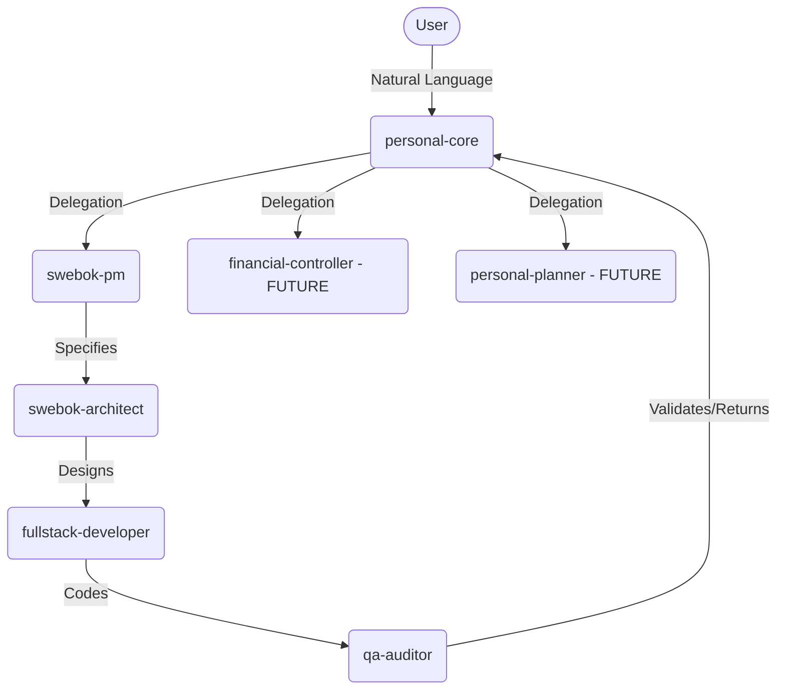

# GitAgent AI Core Architecture

This document describes the multi-agent AI framework implemented in `personal-agent`, based on the GitAgent full template structure. 

## 1. System Topology

The ecosystem consists of a **Core Orchestrator** and localized **Sub-Agent Swarms**, functioning together recursively. 
Currently, the primary swarm is the **Software SWEBOK Squad**.

## 2. Interaction Workflow: Software Planning & Development

The interaction between agents is strictly choreographed to enforce SWEBOK principles:

1. **User Request Initiation:** The user tells `personal-core` (the orchestrator) they want a new feature (e.g., "Build an email module").
2. **Delegation to PM:** `personal-core` parses the intent, realizes it's an engineering task, and invokes `swebok-pm`.
3. **Requirement Gathering:** `swebok-pm` asks clarifying questions (if needed) or generates a formal `PRD.md` containing Epics and User Stories.
4. **Architectural Design:** `swebok-pm` hands the PRD to `swebok-architect`. The architect writes the `ADR.md` (identifying database schema, REST API layout, tech stack choice) and C4 Model diagrams.
5. **Implementation:** The architect dispatches the specs to `fullstack-developer`, who sets up the environment and writes the functional and test code.
6. **Code Audit:** The developer triggers `qa-auditor` upon completion. The auditor runs linting, tests, and security analyses. If there is a failure, it bounces back to `fullstack-developer`.
7. **Resolution:** Upon passing QA, the result bubbles back up to `personal-core`, which writes to the global `/memory` that the Epic is completed and notifies the User.

## 3. Global Artifacts vs Local Artifacts

### Local Agent Files
Each agent resides in `c:\devWorkspace\personal-agent\agents\<AgentName>\` and has:
- `agent.yaml`: The schema definition for gitagent cli (runtime config, LLM details).
- `SOUL.md`: Persona definition, tone, constraints.
- `DUTIES.md`: Expected behaviors, periodic tasks, responsibilities.

### Shared Global Assets
While agents are isolated logistically, they share:
- `.agents/skills`: Directives that any agent can ingest.
- `.agents/rules`: Repository-wide code standards (e.g. Conventional Commits).
- `.agents/workflows`: Step-by-step procedures (e.g., `/planning.workflow`) invoked by `swebok-pm`.

## 4. Expansion Plan

The architecture is designed to expand horizontally. 
To add **Financial Control**:
1. Create `agents/financial-controller/agent.yaml`.
2. Give it skills to parse bank CSVs or hit API endpoints.
3. Add it to `personal-core` dependencies.

To add **Personal Planning**:
1. Create `agents/personal-planner/agent.yaml`.
2. Connect it to Google Calendar via tools.
3. Trigger delegation in `personal-core` for intent `calendar_management`.
